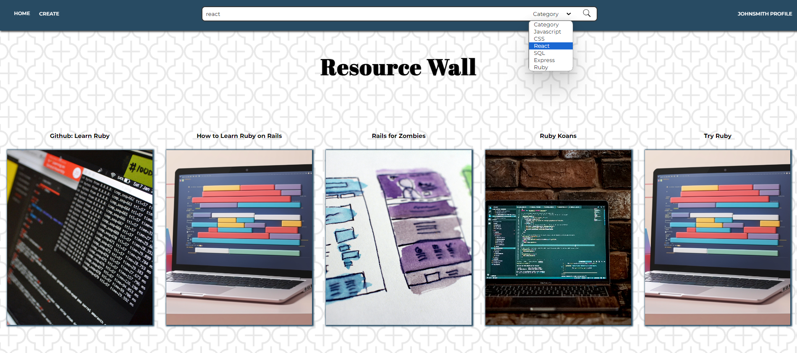
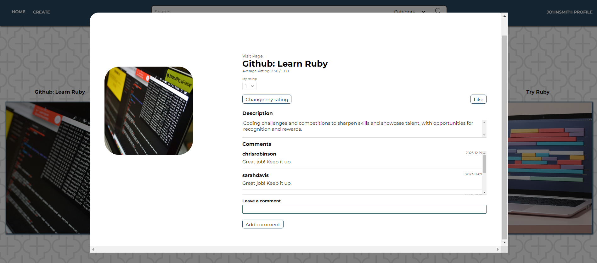
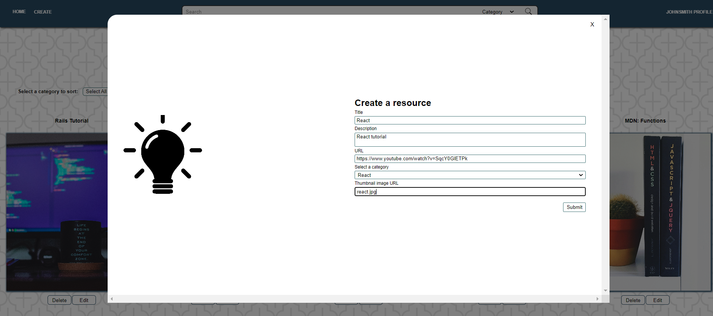
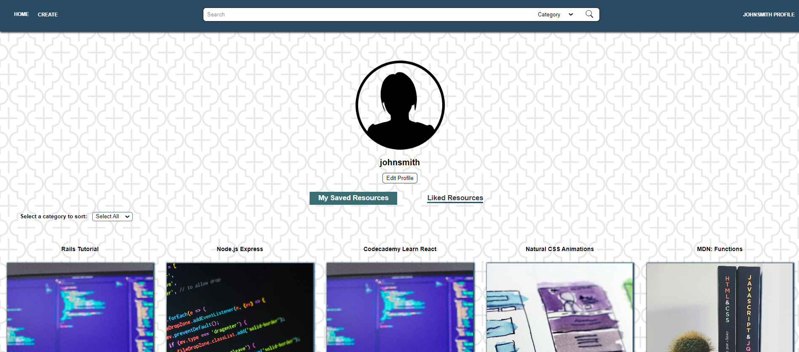
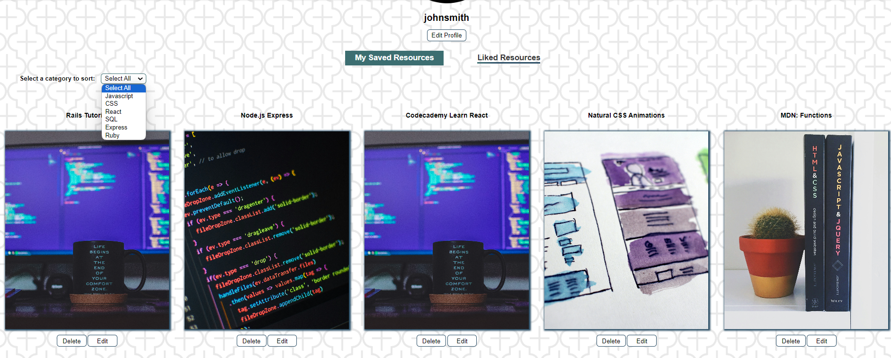
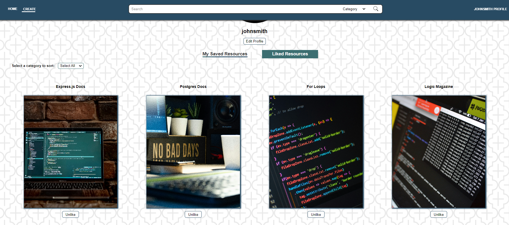
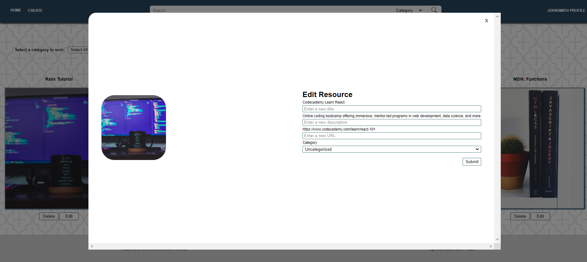

# Resource Wall
Resource Wall is like Pinterest for learners — it allows learners to save learning resources in a central place that is publicly available to any user. This is a midterm project, developed as part of the learning process at Lighthouse Labs.

## Final Product
Home page 

Resource information modal

Create resource modal

Profile page

Saved resources

Liked resources

Edit resource modal

## Features
* Users can view and search for resources created by any user.
* Logged-in users can create their own resources by saving an external URL along with a title and description and categorizing any resource under a topic.
* Logged-in users can comment on any resource.
* Logged-in users can rate any resource and change their rating.
* Logged-in users can like and unlike any resource.
* Logged-in users can view all their own and all liked resources on their profile page.
* Logged-in users can update their profile.
* Logged-in users can edit or delete their own resources.

## Setup

* Install dependencies with `npm install`.
* Create the `.env` by using `.env.example` as a reference: `cp .env.example .env`
* Update the .env file with your correct local information 
* Reset database: `npm run db:reset`
* Run the server: `npm start`
* Visit `http://localhost:8080/`

## Dependencies

- Node 10.x or above
- NPM 5.x or above
- PG 6.x
